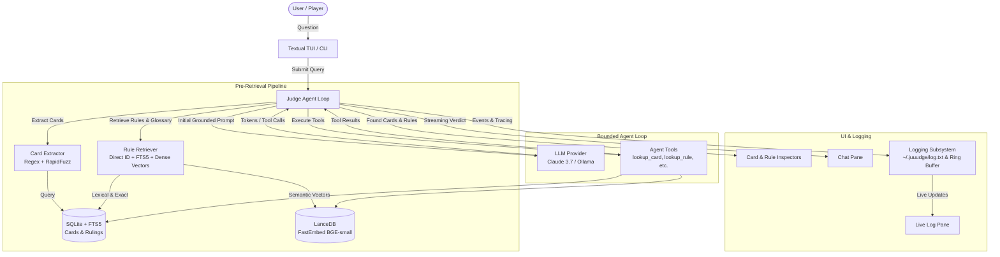

# juuudge Architecture & Flow

This document details the architectural design, component layers, data structures, and end-to-end execution flow of **juuudge**, an offline-capable AI MTG Rules Judge.

---

## 1. System Overview

---

## 2. Component Architecture

### A. Ingestion & Parsing Subsystem (`juuudge/ingest/`)
- **`cr_parser.py`**: Parses the raw official Magic Comprehensive Rules text file into structured `Rule` and `GlossaryTerm` models. Maintains hierarchy (Chapter > Section > Rule ID > Sub-rules).
- **`card_parser.py`**: Parses bulk card exports from Scryfall along with official Gatherer rulings, mapping them into normalized `Card` models.
- **`sync.py`**: Orchestrates downloading, parsing, SQLite database population, and vector embedding generation in LanceDB.

### B. Storage & Retrieval Subsystem (`juuudge/storage/` & `juuudge/retrieval/`)
- **SQLite + FTS5 (`db.py`)**: Stores cards, rulings, rules, and glossary definitions. Provides fast exact lookups by primary key and BM25 full-text search across card text and rules.
- **LanceDB Vector Store (`vector.py`)**: Stores 384-dimensional dense vector embeddings generated by `fastembed` (`BAAI/bge-small-en-v1.5`) for semantic rule and glossary search.
- **Card Extractor (`card_extractor.py`)**: Multi-stage entity recognition for cards mentioned in queries:
  1. High-priority bracket matching (`[[Card Name]]`).
  2. Whole-word boundary regex scanning against all known card names (sorted by length descending).
  3. Fuzzy partial-ratio matching with rapidfuzz for minor typos.
- **Rule Retriever (`rule_retriever.py`)**: Hybrid retrieval combining:
  1. Direct Rule-ID fast path (e.g. `613.1d`).
  2. FTS5 BM25 lexical search.
  3. LanceDB dense semantic vector search.
  4. Hierarchical rule expansion (automatically fetching parent and sibling rules for complete layer context).
  5. FTS5 + vector glossary term matching.

### C. Agent Loop & Tools (`juuudge/agent/`)
- **Judge Loop (`judge_loop.py`)**: Manages the multi-turn conversational loop. Injects deterministic pre-retrieved context into the initial prompt and bounds tool execution to `max_tool_rounds` (default: 3) to prevent runaway loops.
- **Tool Schemas (`tool_schemas.py`)**: Standardized schemas for:
  - `lookup_card(name)`: Look up Oracle text, types, mana cost, and Gatherer rulings.
  - `lookup_rule(rule_id)`: Look up exact rule text, examples, and sibling rules.
  - `lookup_glossary(term)`: Look up official game definitions.
  - `search_rules(query)`: Search rules via keywords or semantic search.
- **Tool Execution (`tools.py`)**: Executes tool calls against the local SQLite and LanceDB instances.

### D. Provider Layer (`juuudge/agent/providers/`)
- **`base.py`**: Abstract `LLMProvider` interface defining streaming and tool-calling contracts.
- **`anthropic_provider.py`**: Anthropic Messages API client supporting streaming and structured tool calling with models such as Claude 3.7 Sonnet.
- **`ollama_provider.py`**: Local Ollama HTTP streaming client supporting local models such as Llama 3.3.

### E. Logging & Observability (`juuudge/logger.py`)
- Standardized logging across 4 severities (`LOG`, `INFO`, `WARN`, `ERROR`).
- Log format: `YYYY-MM-DD HH:MM:SS [SEVERITY] [sourcefile.py:lineno] message`.
- Dual destination:
  1. File handler: Persisted to `~/.juuudge/log.txt` (or `JUUUDGE_DIR`).
  2. Ring buffer: Thread-safe in-memory buffer holding the latest 10 logs with observer callbacks for real-time TUI display.

### F. Security & Cryptography (`juuudge/crypto.py`)
- Persistent AES-GCM encryption using a dedicated `master.key` file with `0600` permissions.
- Secret masking (`sk-ant-…xxxx`) and safe fallback decryption to avoid dumping corrupted control bytes to the terminal.

---

## 3. End-to-End Execution Flow

When a user submits a rules query (e.g., *"Does Blood Moon kill Urza's Saga?"*):

```mermaid
sequenceDiagram
    autonumber
    actor User
    participant TUI as JuuudgeApp (TUI / CLI)
    participant Agent as JudgeAgent
    participant Extract as CardExtractor
    participant Retrieve as RuleRetriever
    participant DB as SQLite & LanceDB
    participant Provider as LLM Provider
    participant Logger as Logging System

    User->>TUI: Enter question
    TUI->>Logger: Log question submission
    TUI->>Agent: ask_stream(question)
    
    rect rgb(30, 35, 45)
        note right of Agent: Phase 1: Deterministic Pre-Retrieval
        Agent->>Extract: extract(question)
        Extract->>DB: Scan card names & regex
        DB-->>Extract: [Blood Moon, Urza's Saga]
        Extract-->>Agent: cards_found
        
        Agent->>Retrieve: retrieve(question)
        Retrieve->>DB: FTS5 + Vector + Hierarchical Expansion
        DB-->>Retrieve: [CR 613.1d, CR 704.5s, CR 714.4]
        Retrieve-->>Agent: rules_found & glossary
        
        Agent-->>TUI: Emit cards_found & rules_found
        TUI->>TUI: Update Card & Rule Inspector Panes
    end

    rect rgb(35, 40, 30)
        note right of Agent: Phase 2: Grounded Prompt & Bounded Tool Loop
        Agent->>Agent: Construct system prompt + grounded context
        Agent->>Provider: stream_completion(messages, tools)
        Provider-->>Agent: Stream tokens / ToolCallRequest
        
        opt Agent calls tool (e.g. lookup_rule)
            Agent->>Logger: Log tool execution
            Agent->>DB: Execute lookup_rule(613.1d)
            DB-->>Agent: Sibling rules & layer details
            Agent->>Provider: Send tool_result block
            Provider-->>Agent: Stream verdict tokens
        end
    end

    rect rgb(30, 30, 40)
        note right of Agent: Phase 3: Response Streaming & UI Render
        Agent-->>TUI: Stream token chunks
        TUI->>TUI: Update Chat Pane with Rich Markdown
        Agent-->>TUI: emit done
        Agent->>Logger: Log adjudication completion
    end
```

### Detailed Step Walkthrough:
1. **Input Submission**: The user submits a question via the TUI input box or CLI `juuudge ask`.
2. **Deterministic Entity Extraction**: `CardExtractor` identifies mentioned card names (e.g., *Blood Moon*, *Urza's Saga*) and fetches their full Oracle texts, types, mana costs, and Gatherer rulings.
3. **Hybrid Rule Retrieval**: `RuleRetriever` searches the Comprehensive Rules using lexical FTS5, dense vector search, and hierarchical expansion (fetching parent and sibling sub-rules).
4. **Inspector Updates**: Pre-retrieved cards and rules are immediately emitted to the TUI to update the side inspector panes.
5. **Grounded Context Injection**: The prompt is assembled with explicit card texts, rule citations, and glossary definitions before contacting the LLM.
6. **Streaming & Bounded Tool Execution**: The LLM streams reasoning and can invoke local tools if additional rulings or rules are needed.
7. **Verdict & Citation Output**: The LLM delivers a standardized verdict, step-by-step mechanics breakdown, and clickable markdown links to Scryfall and Yawgatog.
