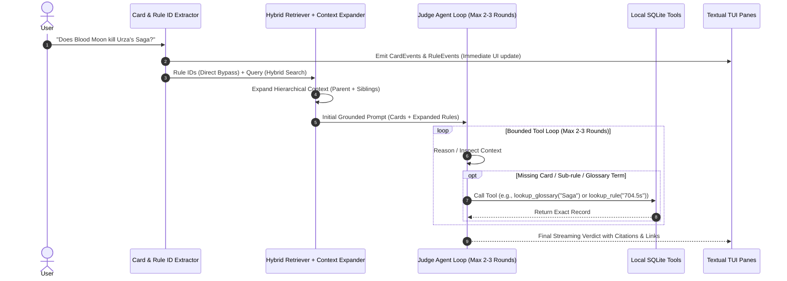

# Design Document: `juuudge` - Magic: The Gathering Rules AI Agent CLI

**Date:** 2026-09-04  
**Status:** Approved (v1 Scoped + Bounded Tool Loop & Hierarchical Expansion)  
**Author:** Antigravity & User  

---

## 1. Overview & Goals

`juuudge` is a high-performance terminal CLI and interactive TUI (Terminal User Interface) AI assistant specialized in adjudicating Magic: The Gathering (MTG) rules, interactions, priority timing, and layer system mechanics.

### Primary Objectives
1. **Accurate & Authoritative MTG Rules Grounding:** Eliminate AI hallucinations by grounding all answers with official WotC Comprehensive Rules (CR) text, Scryfall Oracle card texts, and Gatherer rulings.
2. **Hierarchical Context Expansion & Direct Rule-ID Bypass:** Exact rule IDs (e.g., `613.1d`, `704.5s`) bypass vector search via $O(1)$ direct index lookup. Rule hits automatically expand to include parent section intros and sibling rules (essential for Layer, Dependency, and Timestamp interactions).
3. **Bounded Agentic Judge Loop:** A bounded multi-turn agent loop (capped at max 2–3 rounds) where the LLM can call local tools (`lookup_card`, `lookup_rule`, `lookup_glossary`, `search_rules`) to pull missing context before delivering the final verdict.
4. **Fast & Intuitive 3-Pane Textual TUI:** A responsive split-pane interface showing the chat verdict, active card oracle/rulings, and cited comprehensive rules side-by-side with a single clean dark theme.
5. **Rich Web References:** Automatically embed clickable links to Scryfall for card lookups and official online rules resources (e.g. Yawgatog / WotC anchors) for rule verification.
6. **Clean Extensible LLM Interface:** Abstract `LLMProvider` supporting Anthropic Claude (`claude-3-7-sonnet` / `claude-3-5-haiku`) as the primary cloud provider and local `Ollama` for offline generation.

---

## 2. Architecture & Data Ingestion

```
+-----------------------------------------------------------------------------+
|                           DATA INGESTION (`juuudge sync`)                   |
|                                                                             |
|  [Scryfall Bulk API]                  [Wizards of the Coast (WotC)]         |
|  (default-cards.json & rulings)       (MagicCompRules.txt)                  |
|          │                                     │                            |
|          ▼                                     ▼                            |
|  ┌──────────────┐                     ┌──────────────────────────┐          |
|  │ Card Parser  │                     │ Hierarchical CR Parser   │          |
|  └──────┬───────┘                     └────────────┬─────────────┘          |
|         │                                          │                        |
|         │                                ┌─────────┴──────────┐             |
|         │                                ▼                    ▼             |
|         │                        ┌──────────────┐     ┌──────────────┐      |
|         │                        │ Rules Tree   │     │ Local Vector │      |
|         │                        │ & Glossary   │     │ Embedder     │      |
|         │                        └──────┬───────┘     └──────┬───────┘      |
|         ▼                               ▼                    ▼              |
|  ╔═══════════════════════════════════════════════════════════════════════╗  |
|  ║              Local Storage SQLite DB (~/.juuudge/juuudge.db)          ║  |
|  ║  • cards & cards_fts (Oracle, Mana, Types, Rulings, Scryfall URIs)    ║  |
|  ║  • rules & rules_fts (Chapter, Section, Rule ID, Text, Examples)      ║  |
|  ║  • glossary & glossary_fts (MTG Legal Definitions)                    ║  |
|  ║  • vector_index (Dense embeddings for semantic rule retrieval)        ║  |
|  ╚═══════════════════════════════════════════════════════════════════════╝  |
+-----------------------------------------------------------------------------+
```

### 2.1 Storage Layout
* Directory: `~/.juuudge/` (or `$XDG_DATA_HOME/juuudge/`)
  * `juuudge.db`: SQLite database holding cards, rulings, rules, glossary, and vector tables.
  * `config.toml`: User configuration.
  * `cache/`: Downloaded raw Scryfall bulk JSON and `MagicCompRules.txt` with checksum tracking.

### 2.2 Hierarchical Comprehensive Rules (CR) Chunking
Rather than naive token-window splitting, `juuudge` parses the CR along its natural legal hierarchy:
* **Sub-rule Records:** Atomic rules (`613.1a`, `704.5s`, `603.3`) linked to parent sections and chapters with examples attached.
* **Section Records:** Macro-sections (e.g. `613. Interaction of Continuous Effects`) for high-level conceptual matching.
* **Glossary Records:** Dedicated entries for ~400 defined terms (*"Active Player"*, *"Priority"*, *"Replacement Effect"*, *"State-Based Action"*).

### 2.3 Direct Rule-ID Bypass & Hierarchical Expansion
1. **Direct Rule-ID Fast-Path ($O(1)$ Bypass):**
   * Regex extraction identifies literal rule patterns (e.g. `\b\d{3}\.\d+[a-z]?\b` such as `613.1d`, `704.5s`, `101.4`).
   * Fetches exact records directly by primary key, completely bypassing BM25 and vector embeddings to prevent known semantic failure modes on numeric citations.
2. **Hierarchical Context Expansion:**
   * When a specific sub-rule hits (e.g. `613.1d` - Layer 4 Type Change):
     - Automatically expands to include the **section header & intro** (`613. Interaction of Continuous Effects`).
     - Includes the **parent rule** (`613.1`).
     - Includes **sibling rules** (e.g. `613.1a` through `613.1g` for all layers, `613.7` timestamps, `613.8` dependencies).
   * Ensures the LLM has complete layer/dependency context without exhausting `top_k` with incomplete fragments.

---

## 3. Query Processing & Bounded Tool-Using Judge Loop



### 3.1 Local Tool Definitions for Judge Loop
The agent is provided with local deterministic tools to fetch missing context if needed during reasoning:
* `lookup_card(name: str)`: Returns exact Oracle text, type line, mana cost, and Gatherer rulings.
* `lookup_rule(rule_id: str, expand: bool = True)`: Returns exact rule text + hierarchical parent/sibling expansion.
* `lookup_glossary(term: str)`: Returns official CR definition for a game term.
* `search_rules(query: str, limit: int = 3)`: Fast FTS5 search across the Comprehensive Rules.

*Safety Constraint:* Loop is strictly capped at **3 rounds maximum** to ensure low latency and prevent infinite loops.

### 3.2 Verdict Output Format
1. **Verdict (TL;DR):** Immediate direct ruling.
2. **Step-by-Step Breakdown:** Ordered mechanics resolution (Layers $\to$ Priority $\to$ Triggers $\to$ SBAs).
3. **Official Links & Citations:**
   * Card names formatted with Scryfall URLs: `[Card Name](https://scryfall.com/search?q=%21"Card+Name")`.
   * Rule citations formatted with anchor links: `[CR 613.1d](https://yawgatog.com/resources/magic-rules/#R6131d)`.

---

## 4. User Interface & Experience (Textual TUI & CLI)

### 4.1 3-Pane Responsive Layout (Dark Theme)
```
+-----------------------------------------------------------------------------+
| JUUUDGE - MTG Rules Judge CLI                           [claude-3-7-sonnet] |
+----------------------------------------+------------------------------------+
|  CHAT & VERDICT PANE (60% width)       |  CARD INSPECTOR (40% width, Top)   |
|                                        |  [Blood Moon] {2}{R}               |
|  > Does Blood Moon kill Urza's Saga?   |  Enchantment                       |
|                                        |  Nonbasic lands are Mountains.     |
|  VERDICT:                              |  [Scryfall Link] [Gatherer Rulings]|
|  Yes, Urza's Saga will be put into     +------------------------------------+
|  the graveyard as a state-based        |  RULES INSPECTOR (40% width, Bot)  |
|  action immediately after Blood Moon   |  CR 704.5s (State-Based Actions)   |
|  resolves.                             |  If a Saga has lore counters >=    |
|                                        |  final chapter number and isn't... |
|  STEP-BY-STEP BREAKDOWN:               |                                    |
|  1. In Layer 4 (CR 613.1d), Blood...   |  CR 613.1d (Layer 4 - Type Change) |
|  2. Urza's Saga loses all chapter...   |  [Yawgatog Link]                   |
|  3. CR 704.5s puts it into GY...       |                                    |
+----------------------------------------+------------------------------------+
| > Enter rules question or /command...             [?: Help] [Tab: Switch]   |
+-----------------------------------------------------------------------------+
```

### 4.2 Keybindings & Navigation
* `Tab` / `Shift+Tab`: Cycle focus across Chat, Card Inspector, and Rules Inspector.
* `Enter`: Submit question.
* `?` / `Shift + ?`: Open full **Help & Keybindings Modal**.
* `Ctrl+O`: Open selected Card (Scryfall) or Rule (Yawgatog) in user's default browser.
* `Ctrl+L`: Clear active chat history.
* `Ctrl+K` or `/`: Focus question input bar.
* `Esc` / `q`: Close modals or exit.

### 4.3 CLI Commands & Scripting Interface
* `juuudge`: Launch interactive TUI.
* `juuudge ask "..."`: One-shot query printed directly to stdout with colors and links.
* `juuudge card "<name>"`: Instant offline card oracle & rulings lookup.
* `juuudge rule "<id or query>"`: Instant offline rule text lookup.
* `juuudge sync [--force]`: Syncs card and rules databases.

---

## 5. Configuration & LLM Provider Architecture

### 5.1 Extensible Provider Architecture
```python
class LLMProvider(ABC):
    @abstractmethod
    async def stream_completion(
        self,
        messages: list[dict],
        system_prompt: str,
        tools: list[dict] | None = None
    ) -> AsyncIterator[LLMChunk]:
        """Stream response tokens and handle tool calls."""
        pass

class AnthropicProvider(LLMProvider):
    """Primary cloud provider using Anthropic Claude SDK with tool-use support."""
    pass

class OllamaProvider(LLMProvider):
    """Local offline provider using Ollama API with tool-use support."""
    pass
```

### 5.2 Configuration File (`~/.juuudge/config.toml`)
```toml
[llm]
provider = "anthropic" # "anthropic" or "ollama"
model = "claude-3-7-sonnet"
api_key = "" # Automatically loaded from ANTHROPIC_API_KEY environment variable
temperature = 0.0
ollama_host = "http://localhost:11434"
max_tool_rounds = 3

[rag]
top_k_rules = 5
top_k_glossary = 2
expand_hierarchical_rules = true
embedder = "fastembed"
```

### 5.3 Error Handling & First-Run Experience
* **Auto-Sync Prompt:** If run with an unpopulated database, `juuudge` shows an onboarding progress bar to sync Scryfall and CR data before proceeding.
* **Graceful Degradation:** If offline and no local Ollama model is active, `juuudge card` and `juuudge rule` remain 100% operational as an instant offline MTG reference manual.
* **Disambiguation Modal:** If a card name matches multiple candidates ambiguously, an interactive selector lets the user pick the intended card.

---

## 6. Testing & Quality Strategy
* **Unit Tests (`pytest`):**
  * Direct Rule-ID regex extractor & $O(1)$ fast-path lookup.
  * Hierarchical CR parser & context expander (parent section + sibling rules).
  * Card extractor regex and fuzzy matcher accuracy.
  * SQLite FTS5 search and RRF ranking algorithms.
  * Bounded tool loop termination and tool execution accuracy.
* **Judge Verification Test Suite:**
  * Canonical MTG rules scenarios:
    - Blood Moon + Urza's Saga (Layer 4 / SBA 704.5s)
    - Humility + Opalescence (Layer 6/7b dependency & timestamp loops)
    - Deflecting Swat targeting Counterspell (Legal spell target switching)
    - Replacement effects ordering (Doubling Season + Hardened Scales on AP/NAP)
    - Commander Zone change rules (CR 903.9a/b vs dies triggers)
* **TUI Integration Tests:** Textual `Pilot` automated headless UI interaction tests.
